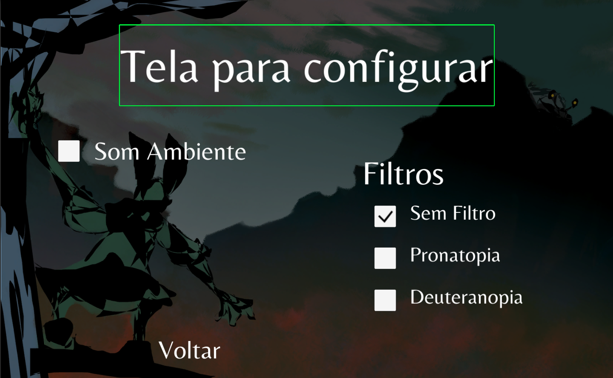
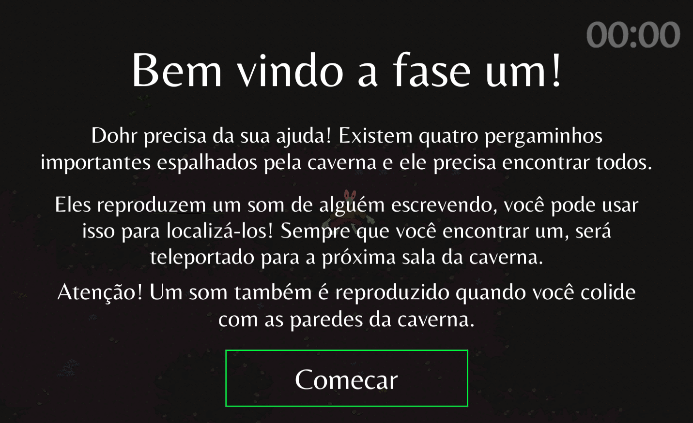
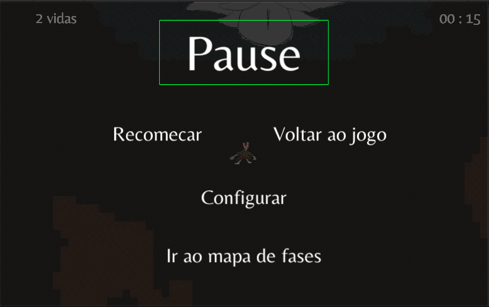
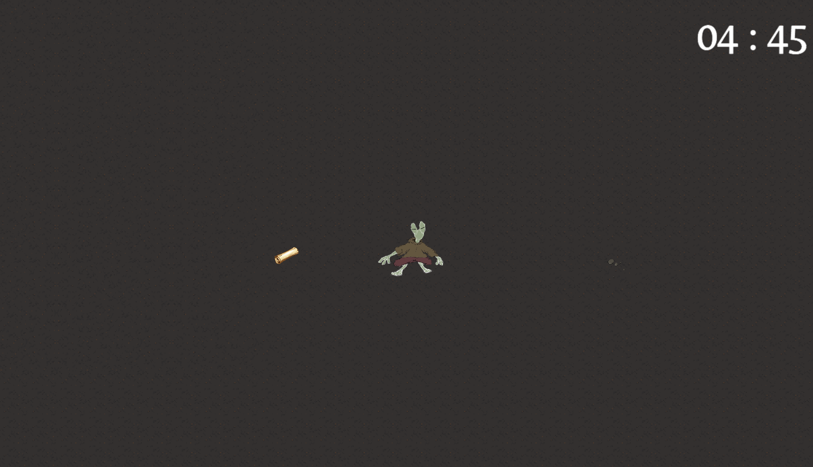
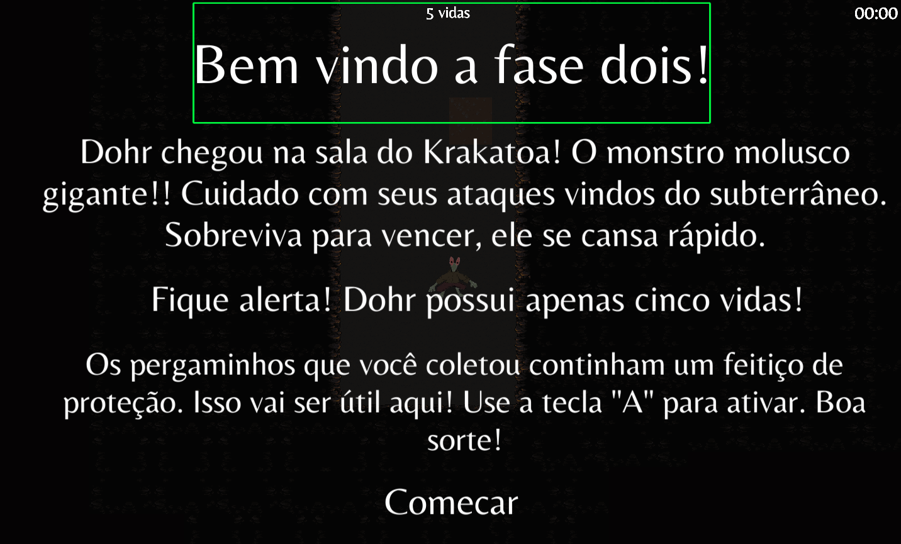
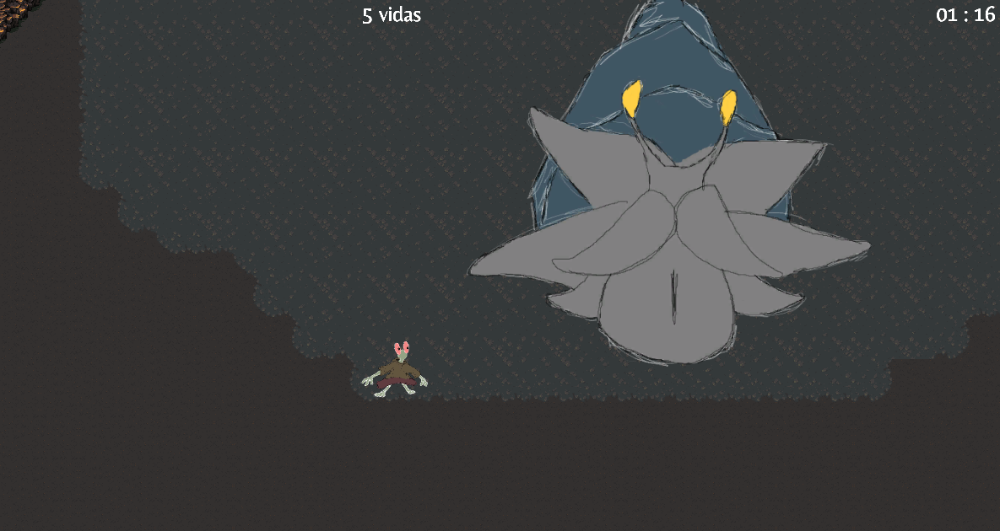
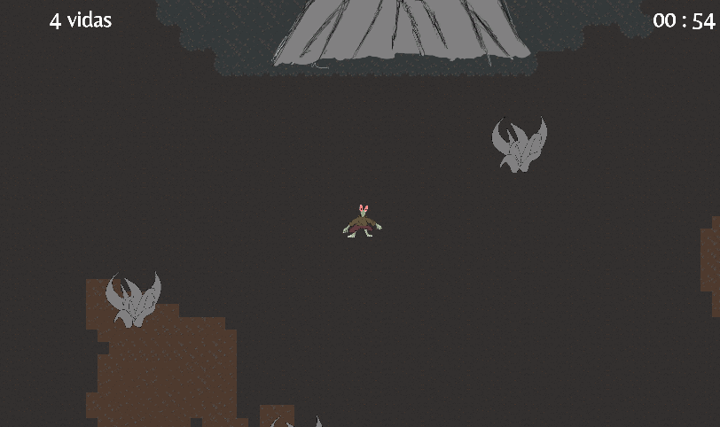
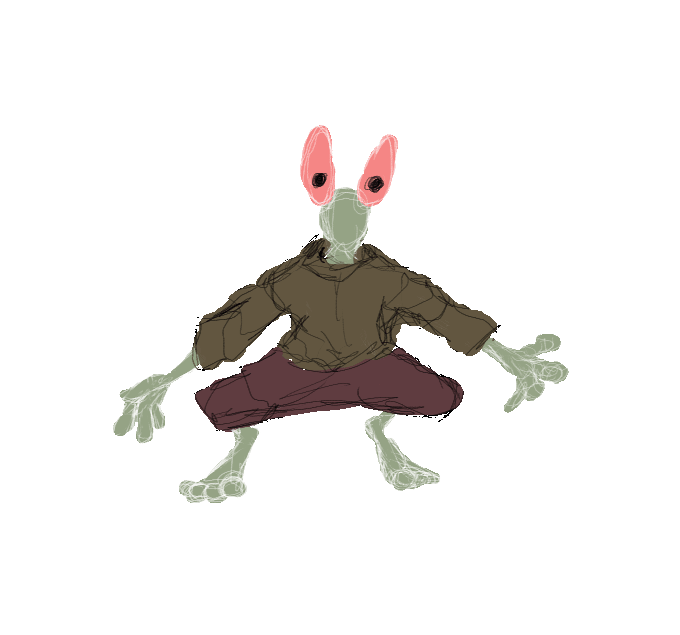
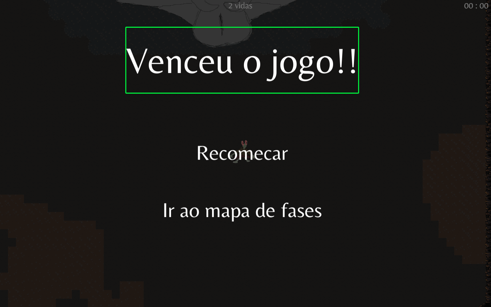

# Dusk_game

## Premissa 
<li>Apresentamos "DUSK", um jogo roguelike, onde o personagem principal Dohr tenta encontrar pedaços de pergaminhos antes que o tempo acabe. Após encontrá-los, ele ganha um poder (escudo) e passa para a próxima fase, onde terá de se defender de ataques do inimigo apelidado de Krakatoa. Krakatoa é um monstro parecido com uma mistura de caracol e lula, com muitos membros, no labirinto ele é uma força que não pode ser desafiada, Dohr tem que desviar dos ataques de seus tentáculos até o tempo acabar.</li>

## Docs
-> <a href="https://drive.google.com/drive/folders/16R7NVVO7QTpo4GkZolMvr6zascrFJvBn?usp=sharing" target=_blank>Artes</a> 
-> <a href="https://docs.google.com/document/d/1zT4ndzxPSvYztC1vMH6I-v4Z5vSIFPKWgnvQzloJpZY/edit" target=_blank>Roteiro</a> 
-> <a href="https://docs.google.com/document/d/1RZ_ua5HROKSYkIR1QPx_zYIoAhEXkRDDkocpV6SrMCA/edit#heading=h.l438tmcgjf58" target=_blank>Fluxo</a> 
-> <a href="https://drive.google.com/file/d/15WtAhqv51TijBK8ap3qI81Zm81JyrVPg/view?usp=sharing" target=_blank>Artigo com informações do Jogo</a> 

## GAMEPLAY/ACESSIBILIDADE

## Equipe  
 <a href="https://github.com/arturgonzaga320" target=_blank>Artur Gonzaga</a>,
 <a href="https://github.com/beacms" target=_blank>Beatriz Camila</a>,
 <a href="https://github.com/Nicolle-Oliveira" target=_blank>Nicolle Taila</a>,
 <a href="https://github.com/sophiaveneres" target=_blank>Sophia de Moura</a>,
 <a href="https://github.com/Thayrelan" target=_blank>Thayrelan Marçal</a>.

## Tela Incial do Jogo

<l> Menu inicial do jogo contendo as opções:
<li> 'Play': Inicia o jogo.
<li> 'Options': Acessa as opções do jogo, tais como ativação de acessibilidade e volume.
<li> 'Quit': Sai do jogo.

## Tela de Opções

<l> Controles de Acessibilidade e volume.
<li> Acessibilidade: Sem filtro ou filtros para tipos de daltonismo.
<li> Volume: Som ambiente.

## Tela de ínicio (play): Como o jogo começa. 

## Tela de Pause:

## Pergaminho encontrada no Mapa

## Tela Fase 2

## Krakatoa

Caracol-lula inimigo de Dohr

## Ataques de Tentáculos

## Escudo

Ao apertar a tecla "A", o escudo é ativado

## Venceu o jogo 

